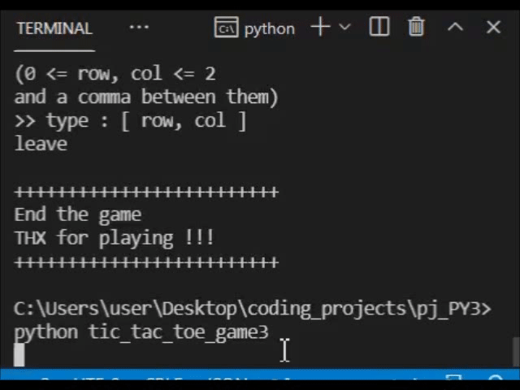

  ### Tic-tac-toe Game
  
  
  
  * Description:
    An interactive game. The user can challenge the computer with 3 levels: easy, mid and master, and free to choose the play order and chess used.
    User is also available to end the game at any time.
    It would automatically compute who wins the game this time and restart the game if the player wants to play again.
    Once the player ends it, a statistic of how many games the player has won/ lose/ draw would show up on the screen.
    
  * Concept:
    Unlike the previous version, this time the whole process (including choosing settings and user playing) is *asynchronously* running by *recursion*. This makes the codes more readable, controllable and easier to maintain.

    Use *bitwise operation* to calculate the status of board.
    Set empty place 0, user 1, computer 2.
    * Use *AND* to know if a lined up in a row/ col/ diagonal:
      - if a row is lined up, ex [2, 2, 2], we got ```2 & 2 & 2 = 2```.
      - if a row is [2, 1, 2], we got ```2 & 1 & 2 = 0```.
      Thus, if the result (I call it point) is 0, we know it's not lined up.

    * Use *AND* to know if any player is about to lined up by putting chess in the empty place:
      - if a row is [1, 0, 1], for the empty grid, the point made by its neighbor is ```1 & 1 = 1```.
      - if it's [0, 2, 1], the point is ```2 & 1 = 0```.
      Thus we will know a player is about to lined up if the point made by its neighbor != 0.
    
    * Use *OR* to know if position1 and position2 are both empty:
      - if position1 = 1 and position2 = 1, the point is ```1 | 1 = 1```.
      - if position1 = 2 and position2 = 1, the point is ```2 | 1 = 2```.
      - if position1 = 1 and position2 = 0, the point is ```1 | 0 = 1```.
      - if position1 = 0 and position2 = 0, the point is ```0 | 0 = 0```.
      Thus we will know position1 and position2 are both empty only if point = 0.

  * libs:     
    Random (Built-in):  Increase unpredictable moves and pick different chess for computer.   
    time (Built-in): Produce asynchronous outputs for better experience.

  * verstion: v3.0.0
  * Preview:
     
